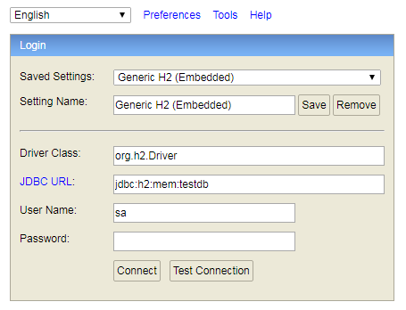
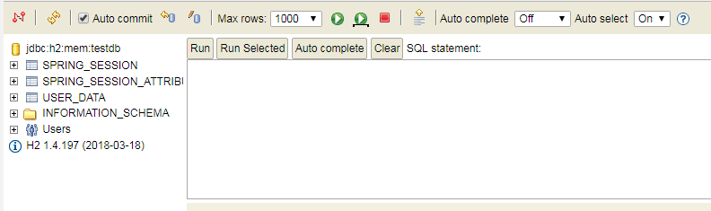
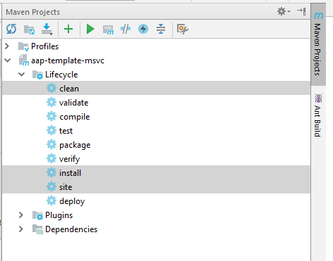
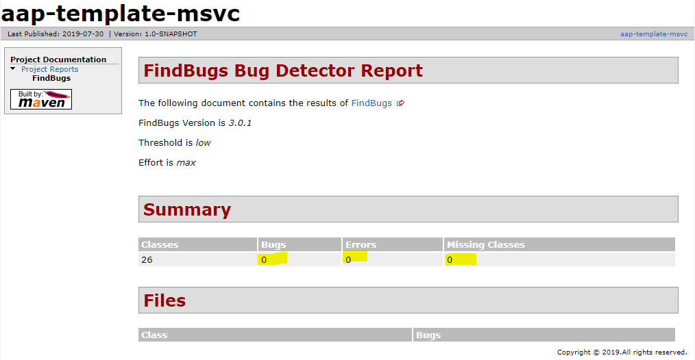
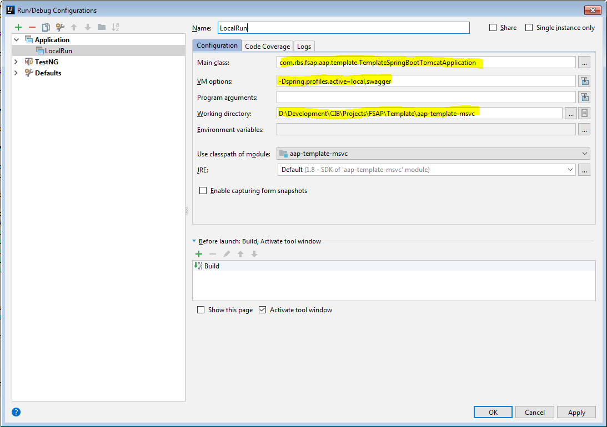
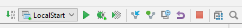
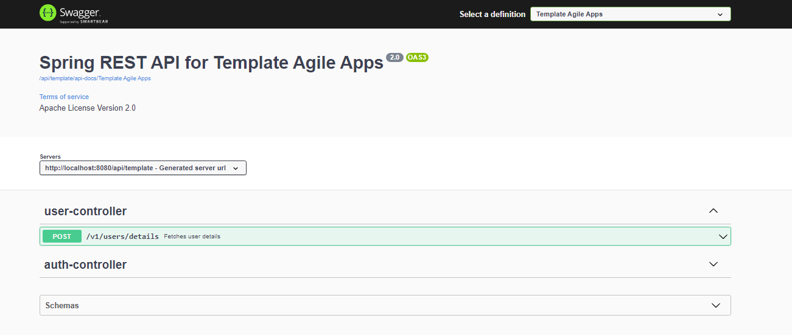
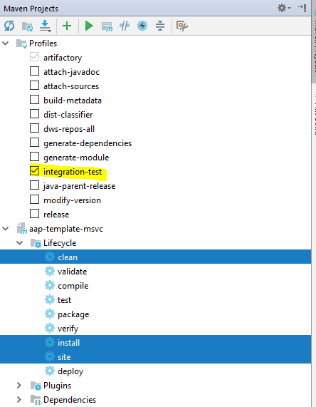

<div align="center">
    <h3 align="center">Learn Spring Boot - template</h3>
</div>

<hr />

## Overview

This project is a simple microservice template with basic configuration and functionality, which serves as a base code
for new applications that require microservice architecture.

The main objectives of this template are:

* Provide a base version of the microservice which covers a lot of boilerplate code to quickly set up new projects.
* Provides user login workflow via IAM out of the box.
* CI/CD integrations with Teamcity and Artifactory related configurations out of the box.
* Prepare unit/integration testing configurations with examples out of the box, which can be easily extended
* Describe documentation approach (e.g. Swagger and Readme.md)
* Make new developers aware of the best practices and approaches used in modern applications
* H2 in memory database integration for writing elaborate, end-to-end integration tests.

## Components

#### H2

H2 database is integrated into this microservice to allow quick start for applications which need spring session
functionality (mandatory for LDAP) or mocking endpoints data
if Oracle or other external DBs are not available.

H2 DB console is accessible by url http://localhost:8080/api/template/h2-console after running application locally. No
password required to login



3 tables should be seen there



#### SonarLint

`SonarLint` is a key plugin to be installed in your IDE for static code analysis.

#### FindBug

`FindBug` is mandatory part of every microservice to run static code check before pushing code into remote repository.
Please note, `FindBug` reporting is one of mandatory steps in Development workflow.
To run it just select "site" maven phase when your code compiled or in conjunction with other maven phases (see bellow)



Successful result is an empty error list in `Findbug` report. To check it go to /target/site folder and open
findbug.html in any browser



## Security

##### Authentication

All endpoints are authenticated using IAM SSO.

Roles:
* `rGWStmplt-TmpltUser` - regular application business users.
* `rGWStmplt-TmpltAdmin` - admin users, who are able to use Admin console

[Spring Session](https://spring.io/projects/spring-session) is used to manage users' sessions. Users sessions are stored
in application database.

##### Authorization

Application uses Spring security by annotating methods with `@RolesAllowed` annotation with necessary groups. All API endpoints
(except actuator endpoints) are protected.


## Getting started

To run application locally, IDEA should be configured with a new application configuration



To run application locally just use IDEA run/debug controls



For PCF deploy and run see `PCF Deployment` topic below

## Environments

The application can use the following types of environments

| Type        | Configuration                 | Purpose                                           |
|-------------|-------------------------------|---------------------------------------------------|
| LOCAL       | application-local.properties  | Development team local testing and investigations |
| DEV-SANDBOX | application-dev-sb.properties | Development team testing and investigations       |
| DEV         | application-dev.properties    | Development team testing and investigations       |
| SIT         | application-sit.properties    | System integration testing                        |
| UAT         | application-uat.properties    | User Acceptance testing                           |
| NFT         | application-nft.properties    | Non-functional testing                            |
| PRD         | application-prd.properties    | released production version                       |

All generic application properties located in application.properties.

The examples below show how to configure application run configuration (IDE) with different types of environments

###### Local

```
-Dspring.profiles.active=local
```

###### DEV

```
-Dspring.profiles.active=dev
```

## Documentation

There are three documentation sources which should be added to any microservice

* Swagger (OpenAPI 3.0) documentation
* README.md file
* CHANGELOG.md file

#### Swagger

Swagger API documentation library is already integrated into this template microservice and can be accessed using
url [Swagger UI](http://localhost:8080/api/template/swagger-ui.html) after running
microservice locally. Two controllers should be visible on the Swagger page



Each endpoint can be tested from the page, providing necessary data.

## Testing

Testing framework integrated into template projects consist of the following libraries:

* TestNG
* Spring Test
* Mockito

#### Unit testing

All unit tests should be written with positive and negative scenarios. Examples of unit test already included into this
code base and can be reviewed and used.

#### Integration testing

Integration test framework already configured and example provided. To create a new integration test, new class should
be named with the same name as target class
with IT suffix. E.g. if target class name is `IAMAuthController`, integration test name should be `IAMAuthControllerIT`.
Integration test should be run autonomously one by one or in scope of full maven build scenario. Please
ensure, `integration-test` profile is activated, as depicted below


